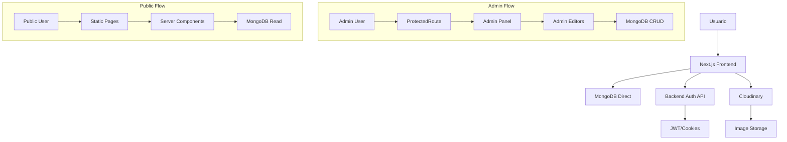

# Estructura del Proyecto - Tapicería Rincón

## 🏗️ Arquitectura General

**Proyecto**: Sitio web corporativo para Tapicería Rincón (Avilés)
**Framework**: Next.js 15.3.8 con App Router
**Lenguaje**: TypeScript
**Estilos**: TailwindCSS + shadcn/ui
**Base de Datos**: MongoDB con Mongoose
**Autenticación**: JWT con backend externo

---

## 📁 Estructura de Directorios

```
web-tapiceriarincones/
├── .windsurf/                    # 📝 Documentación del proyecto
│   ├── acceso-admin.md          # Guía de acceso a administración
│   └── estructura.md            # Este archivo
├── docs/                        # 📚 Documentación adicional
├── src/                         # 💻 Código fuente principal
│   ├── app/                     # 🚀 App Router (Next.js 13+)
│   ├── components/              # 🧩 Componentes React
│   ├── context/                 # 🔄 Contextos de React
│   ├── hooks/                   # 🎣 Custom Hooks
│   ├── lib/                     # 🛠️ Utilidades y configuración
│   └── utils/                   # 🔧 Funciones helper
├── .env                         # 🔐 Variables de entorno
├── package.json                 # 📦 Dependencias y scripts
├── next.config.ts              # ⚙️ Configuración de Next.js
├── tailwind.config.ts          # 🎨 Configuración de Tailwind
└── tsconfig.json               # 📋 Configuración de TypeScript
```

---

## 🚀 App Router (`src/app/`)

### Páginas Principales
- **`page.tsx`** - Página de inicio (landing page)
- **`layout.tsx`** - Layout principal con Header/Footer
- **`admin/page.tsx`** - Panel de administración protegido
- **`login/page.tsx`** - Página de inicio de sesión

### API Routes
- **`api/`** - Endpoints para comunicación con backend

### Características del Layout
```typescript
// layout.tsx - Estructura principal
<AuthProvider>
  <Header globalWhatsapp={globalWhatsapp} globalLogo={globalLogo} />
  <main>{children}</main>
  <Footer contactData={contactData} />
  <Toaster />
</AuthProvider>
```

---

## 🧩 Componentes (`src/components/`)

### 1. **UI Components** (`components/ui/`)
**Base**: shadcn/ui components (34 componentes)
- Button, Card, Input, Dialog, Form, etc.
- Sistema de diseño consistente y accesible

### 2. **Layout Components** (`components/layout/`)
- **`header.tsx`** - Navegación principal con autenticación
- **`footer.tsx`** - Pie de página con información de contacto
- **`logo.tsx`** - Componente del logo

### 3. **Section Components** (`components/sections/`)
**Secciones de la landing page**:
- **`hero.tsx`** - Hero principal con CTA
- **`about.tsx`** - Información sobre la empresa
- **`projects.tsx`** - Galería de proyectos antes/después
- **`clients.tsx`** - Tipos de clientes atendidos
- **`reviews.tsx`** - Testimonios de clientes
- **`contact.tsx`** - Formulario de contacto

### 4. **Admin Editors** (`components/admin-editors/`)
**Editores para el panel de administración**:
- **`HeroEditor.tsx`** - Edición del hero principal
- **`AboutEditor.tsx`** - Edición de sección sobre nosotros
- **`ProjectsEditor.tsx`** - Gestión de proyectos
- **`ClientsEditor.tsx`** - Tipos de clientes
- **`ReviewsEditor.tsx`** - Gestión de testimonios
- **`ContactEditor.tsx`** - Información de contacto
- **`ImageUploader.tsx`** - Componente reutilizable para imágenes

### 5. **Auth Components** (`components/auth/`)
- **`ProtectedRoute.tsx`** - Protección de rutas por rol

---

## 🔄 Contextos (`src/context/`)

### **AuthContext.tsx**
```typescript
interface User {
  name: string;
  email: string;
  role: string; // SuperAdmin, Owner, Admin, Editor, Viewer
}

interface AuthContextType {
  user: User | null;
  isLoading: boolean;
  loadProfile: () => Promise<void>;
  logout: () => Promise<void>;
}
```

**Funcionalidad**:
- Gestión del estado de autenticación
- Comunicación con backend via cookies
- Verificación de perfil y roles

---

## 🎣 Hooks (`src/hooks/`)

### **useAdminSections.ts**
- Gestión de datos del panel de administración
- Carga y guardado de secciones en MongoDB
- Estados de loading y mensajes de feedback

---

## 🛠️ Librería (`src/lib/`)

### 1. **Base de Datos**
- **`mongodb.ts`** - Conexión a MongoDB con caching
- **`models/Section.ts`** - Modelo Mongoose para secciones

### 2. **Utilidades**
- **`roles.ts`** - Sistema RBAC (Role-Based Access Control)
- **`cloudinary.ts`** - Integración con Cloudinary para imágenes
- **`types.ts`** - Definiciones de tipos TypeScript
- **`utils.ts`** - Funciones helper generales

### 3. **Datos**
- **`data/`** - Datos estáticos y placeholders
- **`placeholder-images.ts`** - URLs de imágenes por defecto

---

## 🗄️ Modelo de Datos

### **Section Model** (`models/Section.ts`)
```typescript
interface ISection {
  identifier: 'hero' | 'about' | 'projects' | 'clients' | 'contact' | 'reviews';
  title?: string;
  subtitle?: string;
  content: any; // Estructura específica por sección
  isActive: boolean;
  createdAt: Date;
  updatedAt: Date;
}
```

### **Estructuras de Content por Sección**:

#### Hero Section
```typescript
{
  mainTitle: string;
  subtitle: string;
  whatsappLink: string;
  buttonText1: string;
  buttonText2: string;
  backgroundImage: string;
}
```

#### Projects Section
```typescript
{
  title: string;
  subtitle: string;
  catalogTitle: string;
  projects: [{
    id: string;
    title: string;
    beforeImage: string;
    afterImage: string;
    description: string;
  }];
}
```

---

## 🔐 Sistema de Autenticación y Permisos

### **Jerarquía de Roles** (`lib/roles.ts`)
```typescript
const ROLE_HIERARCHY = {
  SuperAdmin: 100, // Control absoluto
  Owner: 80,      // Dueño del negocio
  Admin: 60,      // Administración
  Editor: 40,     // Gestión de contenido
  Viewer: 20,     // Solo lectura
};
```

### **Flujo de Autenticación**
1. **Login**: Backend externo valida credenciales
2. **Cookies**: Se establece sesión HTTP-only
3. **Verification**: `AuthContext` verifica perfil via `/api/perfil`
4. **Authorization**: `ProtectedRoute` valida acceso por rol
5. **Access**: Si rol ≥ requerido → acceso permitido

---

## 🔄 Flujo de Datos

### **Página Pública (Server Components)**
```typescript
// page.tsx - Datos directos de MongoDB
export default async function Home() {
  const [heroData, aboutData, projectsData, ...] = 
    await Promise.all([
      getSectionDataDirect('hero'),
      getSectionDataDirect('about'),
      // ...
    ]);
  
  return (
    <>
      <Hero data={heroData} />
      <About data={aboutData} />
      {/* ... */}
    </>
  );
}
```

### **Panel de Administración (Client Components)**
```typescript
// admin/page.tsx - Datos via hooks y API
const { sectionData, loadSection, saveSection } = useAdminSections();

// Carga dinámica por sección seleccionada
useEffect(() => {
  loadSection(selectedSection);
}, [selectedSection]);
```

---

## 🎨 Sistema de Estilos

### **TailwindCSS + shadcn/ui**
- **Configuración**: `tailwind.config.ts`
- **Componentes**: Radix UI + Tailwind
- **Temas**: Sistema de colores consistente
- **Responsive**: Mobile-first design

### **Variables CSS**
- **Colores primarios**: Definidos en `globals.css`
- **Tipografía**: Sistema de fuentes consistente
- **Animaciones**: Tailwind animations + Framer Motion

---

## 📦 Dependencias Principales

### **Core Framework**
- `next: 15.3.8` - Framework principal
- `react: ^18.3.1` - UI library
- `typescript: ^5` - Type checking

### **UI & Styling**
- `tailwindcss: ^3.4.1` - CSS framework
- `@radix-ui/*` - Componentes accesibles
- `framer-motion: ^11.5.7` - Animaciones
- `lucide-react: ^0.475.0` - Iconos

### **Backend & Database**
- `mongoose: ^8.21.0` - MongoDB ODM
- `firebase: ^11.9.1` - Para AI/Genkit

### **Forms & Validation**
- `react-hook-form: ^7.54.2` - Form handling
- `zod: ^3.24.2` - Schema validation
- `@hookform/resolvers: ^4.1.3` - Form validation

### **AI & Genkit**
- `genkit: ^1.20.0` - AI framework
- `@genkit-ai/google-genai: ^1.20.0` - Google AI integration

---

## 🔄 Flujo de Trabajo

### **Desarrollo**
```bash
# Desarrollo con Turbopack
pnpm dev          # puerto 9002

# AI Development
pnpm genkit:dev   # Desarrollo de IA
pnpm genkit:watch # Watch mode para IA

# Build y Producción
pnpm build        # Build optimizado
pnpm start        # Servidor de producción
```

### **Gestión de Contenido**
1. **Admin accede** a `/admin` (rol Admin+)
2. **Selecciona sección** a editar
3. **Modifica contenido** via editores especializados
4. **Guarda cambios** → MongoDB
5. **Refleja en sitio** (no cache, `force-dynamic`)

---

## 🔧 Configuraciones Clave

### **Next.js Config**
```typescript
// next.config.ts
export const dynamic = 'force-dynamic';
export const revalidate = 0;
```

### **Environment Variables**
```bash
# .env
MONGODB_URI=                    # Conexión a MongoDB
NEXT_PUBLIC_BACKEND_URL=        # API de autenticación
NEXT_PUBLIC_AUTH_LOGICLAYER=    # Capa de negocio externa
```

---

## 🚀 Despliegue

### **Vercel (Frontend)**
- **Framework**: Next.js con App Router
- **Build Output**: Standalone
- **Environment Variables**: Configuradas en Vercel

### **Hetzner (Backend/DB)**
- **VPS**: Servidor dedicado
- **MongoDB**: Base de datos nativa
- **Dokploy**: Gestión de despliegue

---

## 📊 Arquitectura de Comunicación



---

## 🎯 Patrones y Convenciones

### **Nomenclatura**
- **Components**: PascalCase (`HeroSection.tsx`)
- **Files**: kebab-case para carpetas, PascalCase para archivos
- **Variables**: camelCase
- **Constants**: UPPER_SNAKE_CASE

### **Patrones de Código**
- **Server Components** para datos estáticos
- **Client Components** para interactividad
- **Custom Hooks** para lógica reutilizable
- **TypeScript strict** para type safety

### **Estructura de Datos**
- **MongoDB** para contenido dinámico
- **JSON Schema** para validación
- **RBAC** para permisos
- **JWT** para autenticación

---

## 🔮 Consideraciones Futuras

### **Escalabilidad**
- **Multi-tenant**: Preparado con `multi-tenant` en MongoDB
- **Cache**: Redis para sesiones y datos frecuentes
- **CDN**: Cloudinary ya integrado para imágenes

### **Mejoras**
- **Testing**: Unit tests con Jest
- **Monitoring**: Analytics y error tracking
- **Performance**: Optimización de imágenes y bundle
- **SEO**: Mejoras de metadatos y structured data

---

**Última actualización**: Documentación completa de arquitectura y estructura del proyecto Tapicería Rincón
